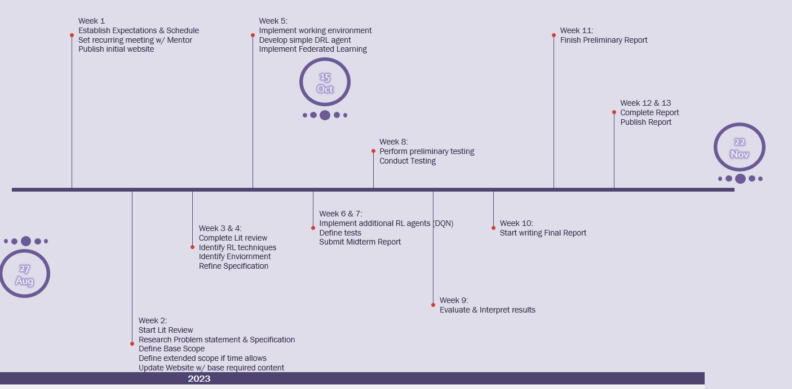

* TOC
{:toc}

## About Me

### Education

I am currently a graduate student at DePaul University pursuing an MS in Artificial Intelligence. I anticipate graduating in late spring of 2024. My undergraduate was a BS in Nuclear Energy Engineering Technology at Thomas Edison State University. 

### Profesional Experience 

I am working at General Electric as a commercial & risk manager in the nuclear power division. Some of my previous roles have been power delivery field engineer, motor & generator specialist, project manager, commercial manager (telecommunications), and engineering manager.

I also spent some time in the US Navy as a second class petty officer (MM2/SS) aboard the USS Pittsburgh (SSN-720) submarine. 

## About My Advisor
### Advisor: Dr. Nazli Siasi

Dr. Nazli Siasi is an assistant professor at the School of Computing in the College of Computing and Digital Media. Before joining DePaul, she worked as an assistant professor of cybersecurity at Christopher Newport University in Virginia. She earned her Ph.D. and M.S. degrees in electrical engineering with focus on networks and security from the University of South Florida in 2020. Prior to that she received her M.S. degree from Amirkabir University of Technology and B.S. degree from Tabriz University. Her research interests include edge/fog computing, network virtualization, blockchain, and cybersecurity

### Research Area

  * Networking, Security, Telecommunication & Networking

### Professional Associations

  * IEEE, ACM

## About My Project:  

## Optimizing target coverage utilizing federated reinforcement learning

### Description
Our project is to optimize target coverage using a federated learning model leveraging reinforcement learning agents at the sensor level. This has applications in security, network rf coverage, and traffic tracking. Specifically, we are applying this federated reinforcement learning to traffic modeling in an effort to optimize coverage of all targets.

### Project Timeline

A Rough timeline of the project

[My Final Report](files/finalreport.pdf)

## My Blog

[My Blog](blog.html)
